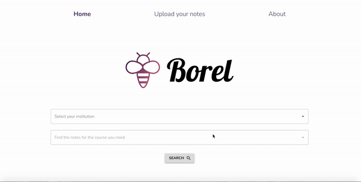

# Borel
[Borel](https://borel.herokuapp.com/) is a simple website where anyone can easily upload and find lecture notes for the courses they need. 

## Built with
* *MERN* (MongoDB, Express, React and NodeJS) stack.
* [Material-UI](https://material-ui.com/) was used for the base React components, but several modifications to the styling were made.
* Image processing in storage with [Cloudinary](https://cloudinary.com/).

## Coming soon...
* Payment integration to make Borel a real note-taking marketplace. 
* Profile pages for note-takers, with reviews and uploaded notes.

## Author
* [Maria Solano](https://mariasolos.github.io/me/) 
